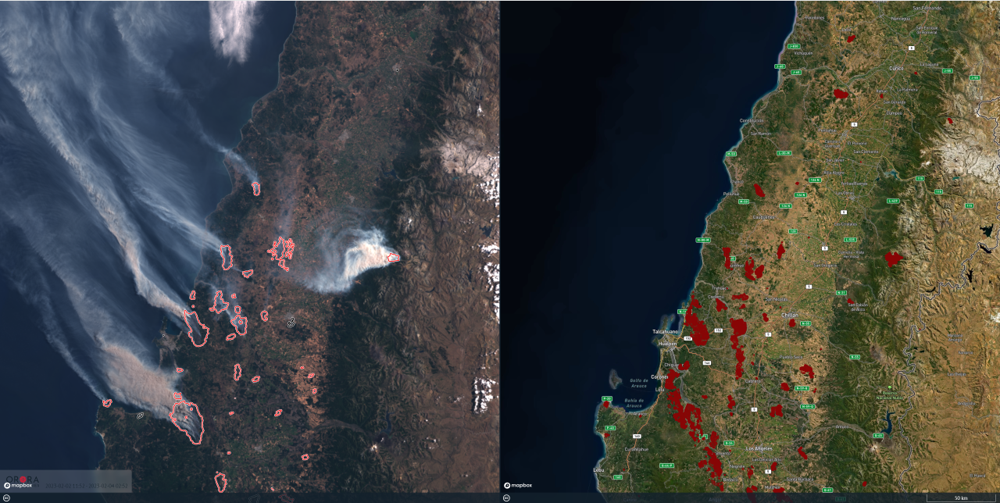
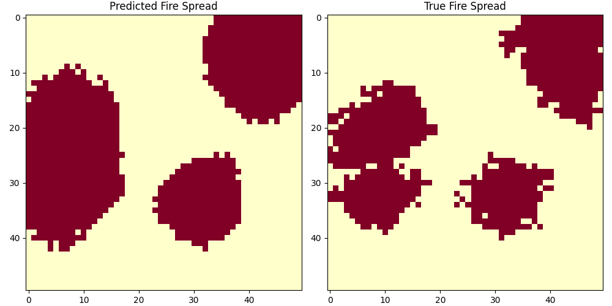
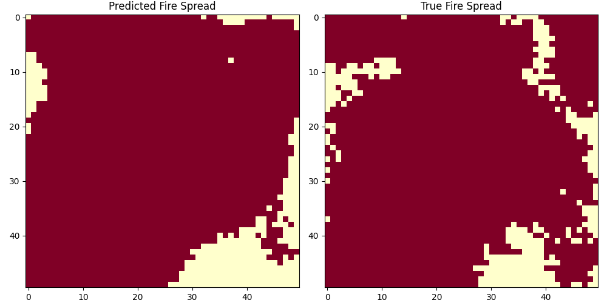

# Aago FAPM: Fire Area Prediction Model

## Overview
This project implements a **Aago FAPM: Fire Apread Prediction Model** using a Transformer-based deep learning architecture. The model is trained on synthetic fire spread data generated using a **probabilistic BFS approach**, which considers environmental factors such as **wind speed, wind direction, and humidity**. The goal is to predict future fire spread patterns based on past fire data and weather conditions.


## Dataset
The simulations for fire spread are inspired by real-world satellite images of wildfires. These satellite images, such as the examples below, are translated into **heatmaps** representing fire intensity. These heatmaps are then used alongside **weather data** (e.g., wind speed, wind direction, humidity) to train the model for predicting fire progression.

### Satellite Image & Corresponding Heatmap

Source: [OroraTech's Satellite Image](https://www.linkedin.com/pulse/how-ororatechs-technology-helped-arauco-tackle-chiles-fierce/)


## Dataset Generation
Fire spread data is generated by simulating fire propagation on a grid. The dataset includes:
- **Grid-based fire spread simulation**
- **Weather conditions per timestep** (wind speed, wind direction, humidity)
- **Dynamic environmental updates** (wind variation, humidity variation, wind-driven jumps)
- **1,000 training simulations** and **100 test simulations** stored as `.pkl` files


## Data Processing
The dataset is preprocessed using **MinMaxScaler** for fire grids and **StandardScaler** for weather conditions. The **FireDataset** class handles:
- Sequence creation with a specified window size
- Normalization of fire grids and weather data
- Sliding window batching for training

## Model Architecture
The fire prediction model is based on a **Transformer encoder** with the following components:
- **Positional Encoding** for sequence-aware learning
- **Multi-Head Self-Attention** for capturing spatial dependencies
- **Feed-Forward Network (FFN)** for feature transformation
- **Layer Normalization & Dropout** for stability and regularization
- **Sigmoid Activation** to predict fire spread probabilities (scaled back to [0,255])

## Training Pipeline
The training pipeline includes:
1. **Data Loading:** Splitting dataset into **80% training** and **20% validation**
2. **Model Initialization:** Using Transformer-based architecture
3. **Loss Function:** Mean Squared Error (MSE)
4. **Optimizer:** Adam optimizer
5. **Training Loop:**
   - Forward pass
   - Backpropagation and optimization
   - Validation after each epoch
6. **Checkpointing:** Saving the best model based on validation loss

## Installation
To run this model, install the required dependencies:
```bash
pip install -r requirements.txt
```

## Usage
### Dataset Generation
To generate the fire spread dataset:
```python
python dataset_maker.py
```
### Training the Model
Run the following command to start training:
```python
python trainer.py
```
### Inference
To use the trained model for fire spread prediction:
```python
python tester.py
```

## File Structure
```
fire_prediction/
│── dataset/
│   ├── fire_dataset.pkl
│   ├── fire_dataset_test.pkl
|── test_results/       
|   │── first_prediction-0-0.png
|   │── first_prediction-0-1.png
|   │── ...
│── model.py            # FireTransformer model implementation
│── dataset.py          # FireDataset class
│── dataset_maker.py    # Fire spread simulation
│── trainer.py          # Model training script
│── tester.py           # Inference script
│── config.py           # Configuration settings
│── checkpoints/        # Saved model weights
|── docs/               # Supporting image files
│── requirements.txt    # Requirements file
│── README.md           # Project documentation
```


## Prediction Results
The model generates images in batches , where each image shows the **original fire spread** vs. the **predicted fire spread**. This visual comparison helps analyze the model's accuracy and improvements over time. 

Example images from **[test_results](./test_results/)** directory:





## Contributors
- [Avaneesh Devkota](https://github.com/avaneeshdevkota)
- [Aavishkar Gautam](https://github.com/aavishkar6)
- [Samyam Lamichhane](https://github.com/declansam)
- [Sandhya Sharma](https://github.com/sandhya-sharrmma)
- [Sarthak Prasad Malla](https://github.com/Sarthak-Malla)


## License
This project is licensed under the **MIT License**.
